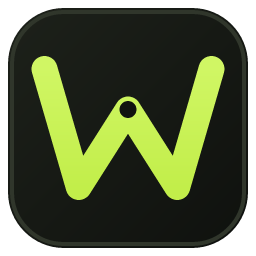
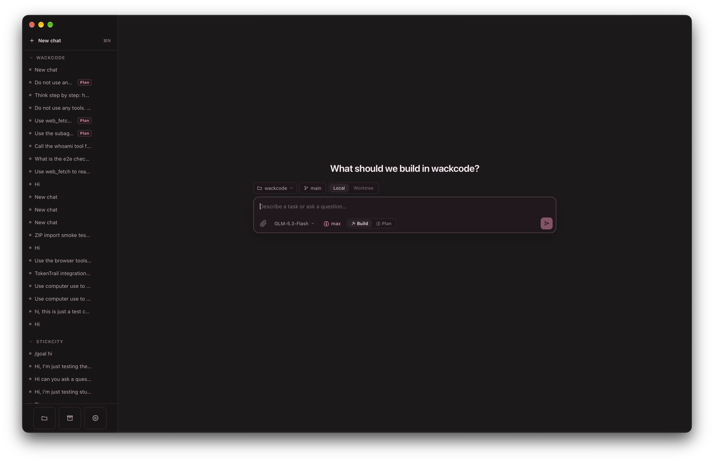
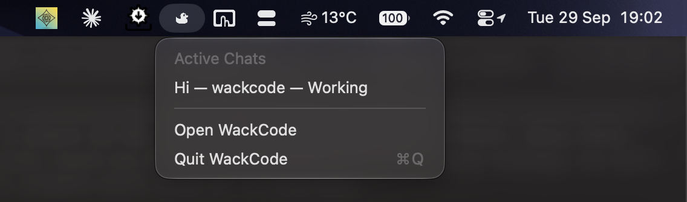
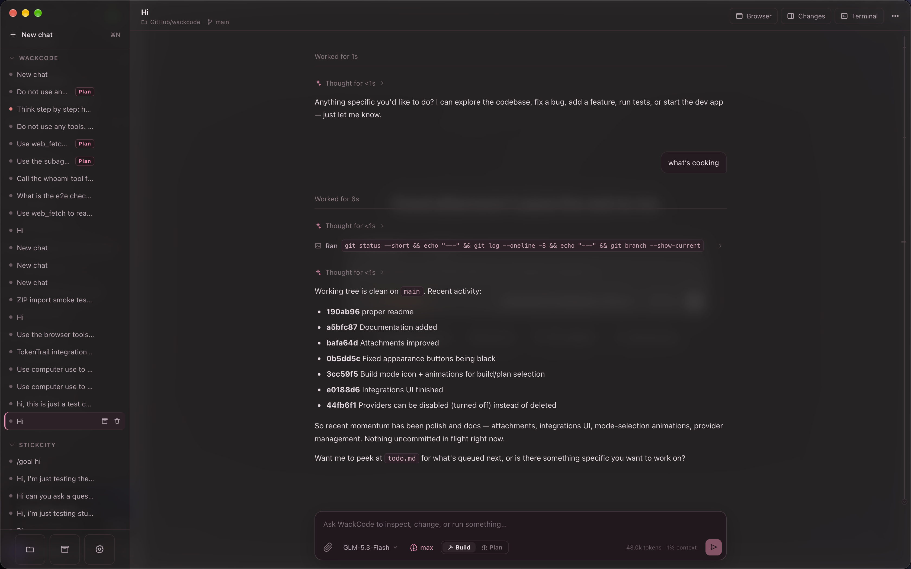
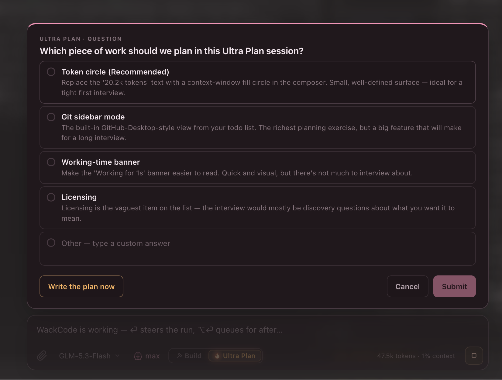
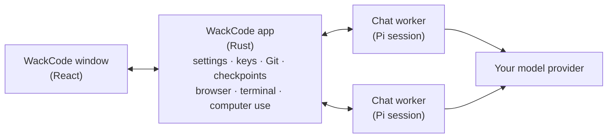

<p align="center">
  
</p>

<h1 align="center">WackCode</h1>

<p align="center">
  <strong>A playful, local-first Mac app for the <a href="https://www.npmjs.com/package/@earendil-works/pi-coding-agent">Pi coding agent</a>.</strong><br>
  Bring your own model. No account, no backend, no telemetry.
</p>

<p align="center">macOS 12+ · Apple Silicon · Tauri 2, React and Rust. (Windows support coming soon)</p>



WackCode gives the Pi coding agent a proper home on your Mac. Open a project, describe what you want, and watch the agent read, edit and run things. You can steer it mid-run, rewind when it goes the wrong way, review its diff, and commit, push or open a PR without leaving the window.

Everything runs locally. Your conversations go straight from your Mac to the model provider you choose, whether that's an OpenAI-compatible API key or an existing subscription (ChatGPT Plus/Pro via OpenAI Codex, GitHub Copilot, Anthropic, xAI, Meta or Kimi For Coding).

## Highlights

- **Many chats at once.** Each chat runs its own agent in the background, in your project folder, a Git worktree, or a scratch folder.
- **Queue first, steer when needed.** Queue messages while the agent works, or steer it to interrupt and send one now.
- **Nothing is lost.** Retry, edit, rewind or fork from any message. Checkpoints can put your files back too.
- **Plan before building.** Plan mode stays read-only by default until you approve a plan; Ultra Plan interviews you first.
- **Review and ship.** A built-in diff view with line comments, generated commit messages, push, and GitHub pull requests.
- **Sees what it builds.** A shared browser preview for web apps, and optional computer use for native Mac and iOS Simulator apps.
- **Extensible.** MCP servers, Agent Skills, slash commands, Pi packages, per-project memory, and optional sub-agents.
- **Just chat, too.** A separate Chat area turns the same connections into a general-purpose chat, with no project and no coding tools.
- **Yours.** Six themes or your own colours, image backdrops, Liquid Glass, and your agent's name. Appearance never changes what the model does.

## Features

### Chats, projects and worktrees

Add a project with <kbd>⌘ O</kbd> and start a chat with <kbd>⌘ N</kbd>. Choose **Local** to work in the folder itself, or **Worktree** to work in a separate Git worktree, so parallel chats don't collide. A chat can also run without a project, in its own scratch folder. In the composer, type `@` to mention a file or folder, and paste, drop or attach files and images.

Each chat keeps its unsent draft while the app is running. Chats keep working when you switch away or close the window; WackCode stays in the menu bar, and quitting stops them. Archive finished chats to tidy the sidebar. Optional chat tabs (Settings › Appearance) can gather chats from every project into one tab strip.

<p align="center"></p>

### Chat mode

The **Code | Chat** switch moves between the coding agent and Chat mode, an ordinary chat with any of your connections. Chat mode has its own prompt and a small set of tools, and no project, shell, terminal, Git, sub-agents, computer use, skills or packages. Each chat gets a private scratchpad folder that its file tools can't leave; it's deleted with the chat. MCP servers and the browser aren't confined to it, so switch on only the ones you'd trust in any chat.

Don't open Chat mode chats in a WackCode build from before Chat mode: an older build would run them as coding chats.

### Queue, steer and rewind

While the agent works, <kbd>Enter</kbd> queues your message for after the active work. Click **Steer** on a queued message to interrupt the agent and send that one next; the rest stay queued.

Every conversation is a tree, so changing course never throws anything away. Retry the last answer, edit an earlier message and send it again, rewind to before any message, flip between versions, or fork a turn into a new chat.

Before every message WackCode checkpoints the chat's files. Each of these actions can put them back too, after listing what changed and asking first. Checkpoints live in a private store and never touch your repository's history. Ignored files and files over 25 MB aren't captured, and checkpoints are off when the workspace is your home folder.



### Plan first

Press <kbd>⇧ Tab</kbd> to cycle Build → Plan → Ultra Plan.

- **Plan** keeps the agent read-only by default. It inspects the project, asks a few questions, and proposes a plan you can approve, revise, save as `PLAN.md`, or discard.
- **Ultra Plan** is a "grill me" interview: the agent asks questions one at a time, each with its recommended answer first, and you can have it write the plan whenever you've said enough. Expect more model usage.

For longer jobs, `/goal <objective>` runs a goal loop: the agent works in rounds until a separate check finds the objective met, and it pauses itself when rounds stop making progress.

**Settings › Tools** can lift the read-only limits on Plan and on sub-agents. Both are off by default, need a confirmation to turn on, and aren't recommended: they allow file changes and unrestricted shell commands on your device, including outside the project. Plans still need your approval, and read-only planning still restricts its sub-agents.



### Review and ship

Open Changes with <kbd>⌘ ⇧ C</kbd> to review staged and unstaged changes file by file. Discard a file or hunk (after a confirmation), or click beside any diff line to leave a comment; **Address comments** sends them all to the agent at once. Commit (the message can be generated from your changes), push, and open a GitHub pull request with an editable title and description, using your existing `gh` login.

### Preview, run and play

- **Browser preview.** A real WebKit page that you and the agent share. Open your localhost dev server and the agent can read the page, click, type, scroll, check console errors and take screenshots (for models that accept images). Each chat has its own cookies and site data, wiped when WackCode quits. You can take control at any time, which pauses the agent's browsing.
- **Computer use** *(optional, off by default, macOS 14+)*. The agent can check native apps it builds, such as Mac, Tauri or Electron apps and the iOS Simulator, working in the background through Accessibility wherever it can. Each app needs your approval for that chat. WackCode itself, terminals, password managers, System Settings and security prompts are always off-limits, and <kbd>⌃ ⌥ ⌘ .</kbd> stops computer use everywhere.
- **Terminal and run command.** <kbd>⌘ ⇧ T</kbd> opens a login shell in the chat's folder, which the agent never sees. You can also save a project command and launch it with one click.
- **Games.** An Arcade with two games, Quack Survivors and Doodle Duck, for the wait while a slow model thinks.

### Extend the agent

- **MCP servers:** tools from local or remote MCP servers, each with its own switch. Remote servers use a token header; OAuth sign-in isn't supported.
- **Agent Skills:** `SKILL.md` folders in `~/.agents/skills`, the same folder Codex, OpenCode and the Pi CLI read. Write or import your own, switch on skill folders from Claude Code, Codex, Pi or OpenCode, or browse pi.dev's catalogue.
- **Commands:** type `/` for built-ins such as `/init` and `/goal`, or for commands from packages, skills and your own prompt templates.
- **Memory:** short per-project notes that the agent recalls in later chats. Every note is a file you can read, edit or delete.
- **Packages:** install Pi packages (extensions, prompt templates and skills) from npm or Git.
- **Web Fetch:** lets the agent read public web pages by URL, never reaching `localhost` or your local network. On by default; switch it off in **Settings › Packages**.
- **Sub-agents** *(optional)*: the agent can hand self-contained tasks to helpers with their own context windows, using WackCode's scout, reviewer and worker roles. Each helper costs extra model usage, so they're off by default; switch them on in **Settings › Packages**.
- **Auto titles** *(optional)*: an `auto-titles` agent, run on a small, cheap model, gives each new chat a title from its first message.

Switch any tool off in **Settings › Tools**, and customise the system prompts in **Settings › Prompts**.

## How it works



- **One agent per chat.** Each chat runs its own [Pi](https://www.npmjs.com/package/@earendil-works/pi-coding-agent) session in a separate background process, so chats run side by side without interfering.
- **Pi does the agent work;** WackCode is the interface and the guardrails. The app bundles its own Node runtime and Pi, so you don't need either installed.
- **Your files, your permissions.** The agent's tools run as your macOS user in the chat's folder, with your normal shell environment, so Homebrew tools, `npx` and friends just work.

## Getting started

You build WackCode from source; it takes a few minutes.

### Requirements

- A Mac with Apple Silicon, running macOS 12 or later (computer use needs macOS 14; Liquid Glass needs macOS 26).
- [Rust](https://rustup.rs) 1.88 or later, Xcode Command Line Tools (`xcode-select --install`), Node.js 24, and pnpm (`corepack enable`).
- Optional: [`gh`](https://cli.github.com) for pull requests, and `ripgrep` and `fd` (`brew install ripgrep fd`) for the agent's `grep` and `find` tools.

### Build and install

```sh
git clone https://github.com/Intelios/wackcode.git
cd wackcode
pnpm install
pnpm build:desktop
```

The app lands in `src-tauri/target/release/bundle/macos/WackCode.app`; drag it into Applications. The build bundles the official Node runtime, checked against the SHA-256 in `runtime-lock.json`. WackCode is signed ad hoc and isn't notarized.

### Connect a model

Open **Settings › Providers** (<kbd>⌘ ,</kbd>) and either:

- **Add a connection:** any OpenAI-compatible endpoint (Chat Completions or Responses) with its API key. Fetch the provider's model list and pick the models you want; Pi's built-in catalogue fills in context limits and reasoning settings, or you can enter them yourself.
- **Sign in with a subscription:** OpenAI Codex (ChatGPT Plus/Pro), GitHub Copilot, Anthropic, xAI, Meta, or Kimi For Coding. Check your provider's terms for third-party apps.

Then press <kbd>⌘ O</kbd> to add a project, pick a model in the composer, and send your first message. Try `/init` to have the agent write an `AGENTS.md` for your project.

## Privacy and security

- **Nothing phones home.** There is no WackCode account, backend, analytics, telemetry, updater or automatic model discovery, and nothing is contacted on launch or on a timer. Pi's own telemetry and update checks are switched off.
- **Your conversations go only to your chosen provider:** the conversation, anything you attach, and whatever project files the agent reads.
- **Keys stay local.** API keys and MCP secrets live in files only your account can read, and a chat's background process receives them privately, never through command-line arguments or environment variables. Subscription sign-ins keep their own credential files, separate from the Pi CLI's.
- **Projects can't run code on their own.** A project's `.pi/` extensions and skill folders never load. Its `AGENTS.md` does, on purpose.
- **Usage ledger.** WackCode keeps a local, usage-only ledger that TokenTrail reads to chart token use and estimated cost. It's on by default; switch it off in **Settings › Integrations**. It holds token counts, provider and model, project and workspace paths, opaque IDs, timing, purpose and outcome, and never prompts, responses, chat titles, credentials, endpoint URLs or tool arguments. The ledger is never sent anywhere, and cost figures are API-equivalent estimates, not your actual subscription spend. The [v1 contract](docs/wackcode-usage-v1.md) documents the format.

It's still an agent with real access to your Mac, so a few things are worth knowing:

- **It's not a sandbox.** The agent's tools, and any stdio MCP servers you add, run with your account's permissions. A project folder or worktree is a working directory, not a boundary. Switch off any tool you don't want in **Settings › Tools**.
- **Packages are ordinary code.** An installed extension can read and write your files, run commands, use the network, and read your API keys. WackCode shows where a package comes from and asks before its first install. Only install what you trust.
- **Computer use permissions cover all of WackCode.** Once you grant Accessibility and Screen Recording, anything WackCode runs (shell commands, MCP servers, extensions) can use them too; only computer use asks per app. Because the app is ad hoc signed, a rebuild can leave an old approval switched on that no longer applies. **Settings › Computer use** can renew it.

<details>
<summary><strong>Everything WackCode connects to</strong></summary>

<br>

- The model providers you configure, and subscription sign-in services after you choose **Sign in**. Expired tokens refresh as part of a model request.
- The npm registry and a package's own source, only while you browse or install packages.
- pi.dev's skill catalogue, only while you browse **Settings › Skills › Browse** (falls back to the npm registry).
- Public web pages the agent reads with Web Fetch during a run: GET requests to public addresses only. Switch it off in **Settings › Packages**.
- Pages you or the agent open in Browser preview, plus their assets, API calls and WebSockets.
- MCP servers you add over HTTP/SSE: only their own address, with the headers you gave. Headers are refused over plain `http://` except to your own Mac.
- Your Git remote when you push, and GitHub (through `gh`) when you open a PR. Reading changes and switching branches use local Git state without fetching.

Generating a commit message sends a bounded diff of your changes to the chat's model. Computer use contacts nothing itself, but window captures and accessibility text of apps you allow go to your model provider like any other tool result.

</details>

<details>
<summary><strong>Where your data lives</strong></summary>

<br>

Everything is under `~/Library/Application Support/com.wackcode.desktop/`: settings and chat metadata, Pi sessions, keys (`secrets.json`) and sign-ins, checkpoints, memory notes, your slash commands, installed packages, copies of background images, and the usage ledger. Deleting a chat deletes its session and checkpoints.

The one exception is your skills, which WackCode writes to `~/.agents/skills` so other tools can share them. Skill folders from other tools are only read, never changed, and deleted skills, commands and notes go to the Trash.

</details>

## Development

```sh
pnpm install
pnpm dev:desktop   # run the app with hot reload
pnpm check         # compile the frontend, worker and Rust
pnpm test          # web, worker and Rust test suites
```

`pnpm mock:provider` starts a deterministic mock model at `http://127.0.0.1:43127/v1` (add it as a Chat Completions connection), and `pnpm mock:mcp` starts a mock MCP server.

Start with [AGENTS.md](AGENTS.md), which holds the project's rules and design direction and is written for human contributors and coding agents alike. The [`docs/`](docs) folder covers the [architecture](docs/architecture.md), the [chat worker](docs/worker.md), the [frontend](docs/frontend.md), [security boundaries](docs/security.md), the [design toolkit](docs/design.md) and [testing](docs/testing.md).

## Acknowledgements

WackCode is built on [Pi](https://www.npmjs.com/package/@earendil-works/pi-coding-agent). Several built-ins are adapted from MIT-licensed work:

- Plan mode and the question dialog, from [`@narumitw/pi-plan-mode`](https://www.npmjs.com/package/@narumitw/pi-plan-mode).
- The todo list, from [`@juicesharp/rpiv-todo`](https://www.npmjs.com/package/@juicesharp/rpiv-todo).
- The sub-agent roles, from Pi's `examples/extensions/subagent` (© Mario Zechner), with the foreground model of `pi-subagents` and WackCode’s background job lifecycle.
