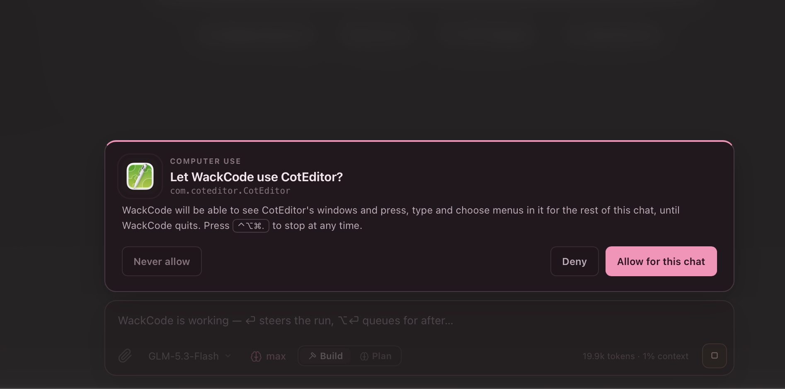
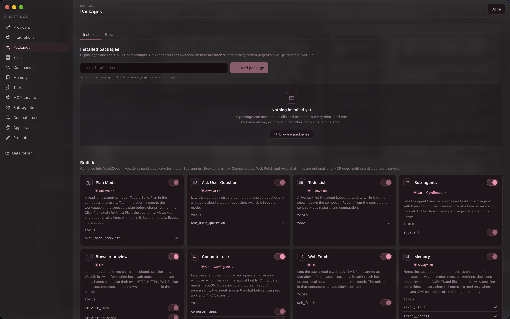
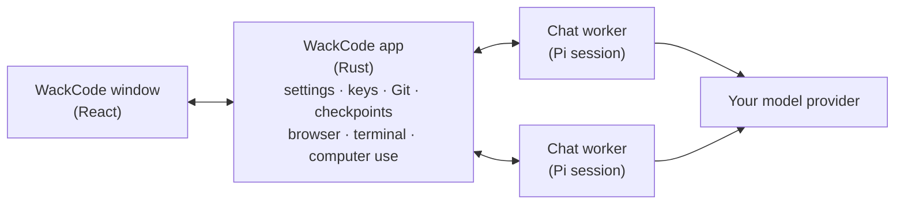

<p align="center">
  
</p>

<h1 align="center">WackCode</h1>

<p align="center">
  <strong>A playful, local-first Mac app for the <a href="https://www.npmjs.com/package/@earendil-works/pi-coding-agent">Pi coding agent</a>.</strong><br>
  Bring your own model. No account, no backend, no telemetry.
</p>

<p align="center">macOS 12+ · Apple Silicon · Tauri 2, React and Rust</p>


WackCode gives the Pi coding agent a proper home on your Mac. Open a project, describe what you want, and watch the agent read, edit and run things. You can steer it mid-run, rewind when it goes the wrong way, review its diff, and commit, push or open a PR without leaving the window.

Everything runs locally. Your conversations go straight from your Mac to the model provider you choose, whether that's an OpenAI-compatible API key or an existing subscription (ChatGPT Plus/Pro via OpenAI Codex, GitHub Copilot, Anthropic, xAI, Meta or Kimi For Coding).

## Highlights

- **Many chats at once.** Each chat runs its own agent in the background, in your project folder, a Git worktree, or a scratch folder.
- **Steer instead of waiting.** Type while the agent works: <kbd>Enter</kbd> redirects the current run, and <kbd>⌥ Enter</kbd> queues a message for after it.
- **Nothing is lost.** Retry, edit, rewind or fork from any message. Checkpoints can put your files back too.
- **Plan before building.** Plan mode keeps the agent read-only until you approve a plan; Ultra Plan interviews you first.
- **Review and ship.** A built-in diff view with line comments, generated commit messages, push, and GitHub PRs, plus Git mode: a GitHub Desktop–style view for reading big diffs, committing, and syncing.
- **Sees what it builds.** A shared browser preview for web apps, and optional computer use for native Mac and iOS Simulator apps.
- **Extensible.** MCP servers, Agent Skills, your own slash commands, Pi packages, per-project memory, and sub-agents.
- **Yours.** Themes, image backdrops, Liquid Glass, and your agent's name.

## Features

### Chats, projects and worktrees

Add a project folder with <kbd>⌘ O</kbd> and start a chat with <kbd>⌘ N</kbd>. A new chat opens as a draft where you pick the project and choose **Local** (work in the folder itself) or **Worktree** (work in a separate Git worktree, so parallel chats don't collide). A chat can also run without a project, in its own scratch folder.

Chats keep working when you switch away, and even when you close the window: WackCode stays in the menu bar, where the duck lists chats that are working or waiting for you. An idle chat's background process stops after 15 minutes and starts again the moment you return. Archive finished chats to tidy the sidebar; the Archived view lets you restore or delete them.

<p align="center"></p>

### Steer the run, never lose work

While the agent works you can keep typing. <kbd>Enter</kbd> **steers**: your message reaches the agent before its next step, so you can correct course without stopping it. <kbd>⌥ Enter</kbd> **queues** the message for after the run. Pending messages sit above the composer until the agent picks them up, and you can pull them back out.

Every conversation is a tree, so changing course never throws anything away:

- **Retry** the last answer, or **edit** an earlier message and send it again.
- **Rewind** to before any message; its text returns to the composer.
- Flip between versions with the **‹ 2/3 ›** switcher, or **fork** any turn into a new chat.

Before every message WackCode takes a checkpoint of the chat's files. Each of these actions offers to put the files back as well: it lists what changed and asks first, and every restore can itself be undone. Checkpoints live in a private store and never touch your repository's history. Ignored files and files over 25 MB aren't captured, and checkpoints are off when the workspace is your home folder.

Instead of a scrollbar, the transcript has a timeline: a tick for each of your messages (hover for the prompt, click to jump), a glowing tick on the turn the agent is working on, and a line that lights up as far as you've read.


### Plan first

Press <kbd>⇧ Tab</kbd> or use the Build/Plan toggle to switch modes:

- **Plan** keeps the agent read-only. It inspects the project, asks a few questions, and proposes a plan you can approve, revise, save as `PLAN.md`, or discard.
- **Ultra Plan** is a "grill me" interview. The agent asks as many questions as it needs, one at a time, with its recommended answer first, before it writes the plan. Press **Write the plan now** whenever you've said enough. Expect more model usage.

For longer jobs, `/goal <objective>` starts a goal loop: the agent works a round, a separate check decides whether the objective is met, and if not, the next step becomes the next round. It pauses itself after three rounds without progress and stops at 25.


### Review and ship

Open the Changes panel with <kbd>⌘ ⇧ C</kbd> to see staged and unstaged changes file by file, with the selected file's diff beside the list.

- Discard a file or a single hunk (after a confirmation).
- Click beside any diff line to leave a comment, then **Address comments** to send them all to the agent at once.
- Commit everything or a single file; committing stages for you. The commit message can be generated from your changes.
- Push to your remote and open a GitHub pull request with an editable title and description (uses your existing `gh` login).
- **Review** in the header asks the Reviewer sub-agent to look over everything uncommitted.

### Git mode

The Changes panel is for glancing at edits while the agent works. For a big diff, press <kbd>⌘ ⇧ G</kbd> (or the branch tile at the bottom of the sidebar) and WackCode turns into a Git client: the sidebar lists the changed files and the whole workspace becomes the diff.

- **Pick a repository** from your projects. Pin the ones you use most; pinned projects also float to the top of the chat sidebar.
- **Read one file at a time**, unified or side by side, at full height.
- **Tick the files to commit**, write a summary and a description (or generate both from the ticked files), and commit. Discard a file or a hunk after a confirmation.
- **Fetch, pull and push** from one button that shows what's next: Fetch, Pull ↓, Push ↑ or Publish branch. Pull only fast-forwards; if your branch and the remote have diverged, nothing is merged and you can ask the agent to rebase or merge.
- **History** lists the branch's commits with their diffs. Undo the latest unpushed commit, revert any commit, or ask the agent to explain or review one.
- **The agent stays in reach.** Line comments, Review and the generated message go through a chat in that project, shown as "via *chat*" in the toolbar. Git mode stays open while the agent works, and the diff updates as it edits.

Git mode works on a project's own folder. A chat that runs in a worktree keeps its changes in its Changes panel.

### Watch what it builds

- **Browser preview.** A real WebKit page that you and the agent share. Open your localhost dev server and the agent can read the page, click, type, scroll, check console errors, and screenshot it for models that support images. Each chat gets its own cookies and site data, wiped when WackCode quits. **Take control** pauses the agent's browsing while you use the page.
- **Computer use** *(optional, macOS 14+)*. Lets the agent check native apps it builds (Mac apps, Tauri or Electron apps, the iOS Simulator) the same way. It works in the background through Accessibility wherever it can, leaving your pointer and your current app alone. The first time a chat wants an app, a card asks you to allow it for that chat, deny it, or never allow it. WackCode itself, terminals, password managers, System Settings and security prompts are always off-limits. <kbd>⌃ ⌥ ⌘ .</kbd> stops computer use everywhere.
- **Terminal.** <kbd>⌘ ⇧ T</kbd> opens a real login shell in the chat's folder. It keeps running when you hide it or switch chats, full-screen programs like `vim` and `htop` work, and the agent never sees it.



### Sub-agents

Switch on sub-agents in **Settings › Packages** and the agent can hand self-contained tasks to helpers with their own context windows, one at a time or several in parallel (up to 8; 4 by default). WackCode ships three roles:

- **Scout:** read-only reconnaissance, including reading docs on the web.
- **Reviewer:** read-only code review.
- **Worker:** makes edits.

You can add your own roles and give each one its own model. Each helper appears as a chip in the chat; click it to watch its reasoning, tool calls and answer live in the side panel, along with its token use and cost. Sub-agents are off by default and only used when you ask, because every one costs extra model usage.

Auto chat titles live here too: switch on the `auto-titles` agent with a small, cheap model, and each new chat gets a proper title from its first message.

### Extend the agent

| Feature | What it does | Where |
|---|---|---|
| **MCP servers** | Adds tools from local (stdio) or remote (HTTP/SSE) MCP servers. Each server and each tool has its own switch. Remote servers use a token header; OAuth sign-in isn't supported. | Settings › MCP servers |
| **Skills** | Agent Skills (`SKILL.md` folders) in `~/.agents/skills`, the same folder Codex, OpenCode and the Pi CLI read. Write, edit or import them (ZIP, folder or `.md`), switch on skill folders from Claude Code, Codex, Pi or OpenCode, or browse pi.dev's catalogue. | Settings › Skills |
| **Commands** | Type `/` for commands from packages, skills and your own prompt templates, which take arguments like `$1` and `$ARGUMENTS`. Built in: `/init` (write or improve an `AGENTS.md`), `/compact`, `/new`, `/name`, `/copy`, `/goal`. | Settings › Commands |
| **Memory** | The agent keeps short notes per project (your preferences, corrections, ongoing decisions) and recalls them in later chats. Every note is a file you can read, edit or delete. | Settings › Memory |
| **Web Fetch** | Lets the agent read a public web page by URL, returned as Markdown. It never reaches `localhost` or your local network. On by default. | Settings › Packages |
| **Packages** | Install Pi packages (extensions, prompt templates, skills) from npm or Git. | Settings › Packages |
| **Tools** | Switch any of the agent's tools off. | Settings › Tools |
| **Prompts** | Customise the system prompt and the Plan / Ultra Plan instructions, and restore the originals at any time. | Settings › Prompts |

In the composer, type `@` to mention a file or folder, and paste, drop or attach files: text files are sent inside your message, and images go to models that support them.



### Make it yours

**Settings › Appearance** changes how WackCode looks, never what the model does:

- Six preset themes (WackCode, Midnight, Grape, Rosé, Ember, Mono), or your own accent and background colours. Code highlighting, diffs and the terminal all follow them, and colours that would be hard to read are adjusted automatically.
- A solid background, your own image (clear on the welcome screen, dimmed and blurred behind chats), or **Liquid Glass** on macOS 26.
- Your agent's name: call it anything you like instead of "WackCode".
- Optional message bubbles, thinking previews, and grouping of the agent's file reads and searches into one "Explored" row.

### Keyboard shortcuts

| Keys | Action |
|---|---|
| <kbd>⌘ N</kbd> | New chat |
| <kbd>⌘ O</kbd> | Add a project |
| <kbd>⌘ ,</kbd> | Settings |
| <kbd>⇧ Tab</kbd> | Cycle Build → Plan → Ultra Plan |
| <kbd>Enter</kbd> / <kbd>⇧ Enter</kbd> | Send (or steer a running chat) / new line |
| <kbd>⌥ Enter</kbd> | Queue a message for after the current run |
| <kbd>⌘ ⇧ C</kbd> | Show or hide Changes |
| <kbd>⌘ ⇧ G</kbd> | Enter or leave Git mode |
| <kbd>⌘ ⇧ T</kbd> | Show or hide the Terminal |
| <kbd>⌃ ⌥ ⌘ .</kbd> | Stop computer use in every chat |
| <kbd>⌘ Q</kbd> | Quit (closing the window keeps WackCode in the menu bar) |

## How it works



- **One agent per chat.** Each chat runs its own [Pi](https://www.npmjs.com/package/@earendil-works/pi-coding-agent) session in a separate background process, so chats run side by side without interfering.
- **Pi does the agent work;** WackCode is the interface and the guardrails. The app bundles its own Node runtime and Pi, so you don't need either installed.
- **Your files, your permissions.** The agent's tools (read, edit, write, bash, grep, find, ls) run as your macOS user in the chat's folder, using your normal shell environment, so Homebrew tools, `npx` and friends just work.
- **Local state.** Settings, chats, sessions, checkpoints and memory live in WackCode's application-data folder on your Mac.

## Getting started

You build WackCode from source; it takes a few minutes.

### Requirements

- A Mac with Apple Silicon, running macOS 12 or later (computer use needs macOS 14; Liquid Glass needs macOS 26).
- [Rust](https://rustup.rs) 1.88 or later, Xcode Command Line Tools (`xcode-select --install`), Node.js 24, and pnpm (`corepack enable`).
- Optional: [`gh`](https://cli.github.com) for pull requests, and `ripgrep` and `fd` (`brew install ripgrep fd`) for the agent's `grep` and `find` tools.

### Build and install

```sh
git clone https://github.com/Intelios/wackcode.git
cd wackcode
pnpm install
pnpm build:desktop
```

The app lands in `src-tauri/target/release/bundle/macos/WackCode.app`; drag it into Applications. The build downloads the official Node runtime (checked against the SHA-256 in `runtime-lock.json`) and bundles it with the agent. WackCode is signed ad hoc and isn't notarized.

### Connect a model

Open **Settings › Providers** (<kbd>⌘ ,</kbd>) and either:

- **Add a connection:** any OpenAI-compatible endpoint (Chat Completions or Responses) with its API key. Search Pi's built-in model catalogue to fill in context limits and reasoning settings, or enter them yourself.
- **Sign in with a subscription:** OpenAI Codex (ChatGPT Plus/Pro), GitHub Copilot, Anthropic, xAI, Meta, or Kimi For Coding. Check your provider's terms for third-party apps.

Then press <kbd>⌘ O</kbd> to add a project, pick a model in the composer, and send your first message. Try `/init` to have the agent write an `AGENTS.md` for your project.

## Privacy and security

- **Nothing phones home.** There is no WackCode account, backend, analytics, telemetry, updater or automatic model discovery, and nothing is contacted on launch or on a timer. Pi's own telemetry and update checks are switched off.
- **Your conversations go only to your chosen provider:** the conversation, anything you attach, and whatever project files the agent reads.
- **Keys stay local.** API keys and MCP secrets live in files only your account can read, and a chat's background process receives them privately, never through command-line arguments or environment variables. Subscription sign-ins keep their own credential files, separate from the Pi CLI's.
- **Projects can't run code on their own.** A project's `.pi/` extensions and skill folders never load. Its `AGENTS.md` does, on purpose.

It's still an agent with real access to your Mac, so a few things are worth knowing:

- **It's not a sandbox.** The agent's tools, and any stdio MCP servers you add, run with your account's permissions. A project folder or worktree is a working directory, not a boundary. Switch off any tool you don't want in **Settings › Tools**.
- **Packages are ordinary code.** An installed extension can read and write your files, run commands, use the network, and read your API keys. WackCode shows where a package comes from and asks before its first install. Only install what you trust.
- **Computer use permissions cover all of WackCode.** Once you grant Accessibility and Screen Recording, anything WackCode runs (the agent's shell commands, MCP servers, extensions) can use them too; only the computer-use tools ask per app. **Settings › Computer use › Reset WackCode's permissions** removes both. Because the app is signed ad hoc, macOS forgets these grants whenever you rebuild it, so reset and allow them again.

<details>
<summary><strong>Everything WackCode connects to</strong></summary>

<br>

- The model providers you configure, and subscription sign-in services after you choose **Sign in**. Expired tokens refresh as part of a model request.
- The npm registry and a package's own source, only while you browse or install packages.
- pi.dev's skill catalogue, only while you browse **Settings › Skills › Browse** (falls back to the npm registry).
- Public web pages the agent reads with Web Fetch during a run: GET requests to public addresses only. Switch it off in **Settings › Packages**.
- Pages you or the agent open in Browser preview, plus their assets, API calls and WebSockets.
- MCP servers you add over HTTP/SSE: only their own address, with the headers you gave. Headers are refused over plain `http://` except to your own Mac.
- Your Git remote when you fetch, pull or push, and GitHub (through `gh`) when you open a PR. Git mode fetches once when you open it or switch its repository, never on a timer and never while it is closed.

Generating a commit message sends a bounded diff of your changes (in Git mode, only the files you ticked) to the chat's model. Computer use contacts nothing itself, but window captures and accessibility text of apps you allow go to your model provider like any other tool result.

</details>

<details>
<summary><strong>Where your data lives</strong></summary>

<br>

Everything is under `~/Library/Application Support/com.wackcode.desktop/`: settings and chat metadata, Pi sessions, keys (`secrets.json`) and sign-ins, checkpoints, memory notes, your slash commands, installed packages, copies of background images, and the usage ledger. Deleting a chat deletes its session and checkpoints.

The one exception is your skills, which WackCode writes to `~/.agents/skills` so other tools can share them. Skill folders from other tools are only read, never changed, and deleted skills, commands and notes go to the Trash.

</details>

## TokenTrail usage tracking

WackCode keeps a local, usage-only ledger that TokenTrail reads to chart your token use and estimated cost. It's on by default; switch it off in **Settings › Integrations**.

Each record holds token counts, the provider and model, project and workspace paths, opaque chat and request IDs, timing, purpose (chat, sub-agent, title, compaction, goal check, commit message, and so on) and outcome. Records **never** contain prompts, responses, chat titles, credentials, endpoint URLs or tool arguments. The ledger lives in `usage/v1/` in WackCode's application-data folder, is kept when chats are deleted, and is never sent anywhere. Cost figures are API-equivalent estimates, not your actual subscription spend. The format is documented in the [v1 contract](docs/wackcode-usage-v1.md).

## What WackCode isn't

WackCode is an early (0.1) project with a deliberately focused scope. It won't gain an embedded code editor, approval prompts for each tool call (computer use's per-app card is the one exception), automatic merging, notarization, auto-updates, or support for other platforms.

## Development

```sh
pnpm install
pnpm dev:desktop   # run the app with hot reload
pnpm check         # compile the frontend, worker and Rust
pnpm test          # web, worker and Rust test suites
```

`pnpm mock:provider` starts a deterministic mock model at `http://127.0.0.1:43127/v1` (add it as a Chat Completions connection), and `pnpm mock:mcp` starts a mock MCP server.

Start with [AGENTS.md](AGENTS.md), which holds the project's rules and design direction and is written for human contributors and coding agents alike. The [`docs/`](docs) folder covers the [architecture](docs/architecture.md), the [chat worker](docs/worker.md), the [frontend](docs/frontend.md), [security boundaries](docs/security.md), the [design toolkit](docs/design.md) and [testing](docs/testing.md).

## Acknowledgements

WackCode is built on [Pi](https://www.npmjs.com/package/@earendil-works/pi-coding-agent). Several built-ins are adapted from MIT-licensed work:

- Plan mode and the question dialog, from [`@narumitw/pi-plan-mode`](https://www.npmjs.com/package/@narumitw/pi-plan-mode).
- The todo list, from [`@juicesharp/rpiv-todo`](https://www.npmjs.com/package/@juicesharp/rpiv-todo).
- The sub-agent roles, from Pi's `examples/extensions/subagent` (© Mario Zechner), with the foreground model of `pi-subagents`.
